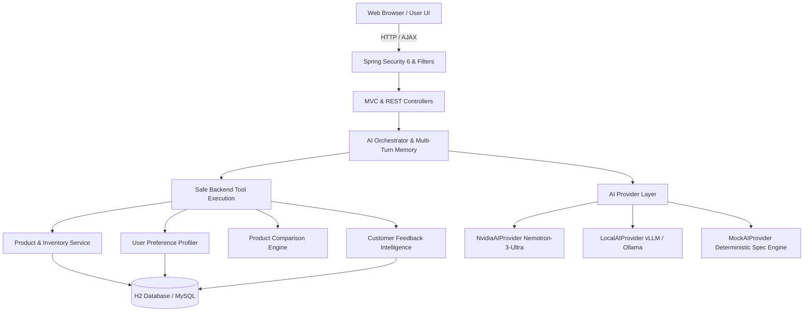

-------------


<div align="center">

# 🌌 OmniMart AI

### Autonomous AI-Powered E-Commerce Platform

[](https://openjdk.org/)
[](https://spring.io/projects/spring-boot)
[](https://build.nvidia.com/)
[](https://render.com/)
[](https://www.brevo.com/)
[](https://opensource.org/licenses/MIT)

**Architected by [Shubh Kumar](https://github.com/shubhyagami)**

</div>

---

## Table of Contents

- [Overview](#overview)
- [Key Features](#key-features)
- [AI Architecture & Guardrails](#ai-architecture--guardrails)
- [Dynamic UI & Particle Engine](#dynamic-ui--particle-engine)
- [Network Geolocation & Mini-Map](#network-geolocation--mini-map)
- [Transactional Emails & OTP](#transactional-emails--otp)
- [AI Comparison Matrix](#ai-comparison-matrix)
- [Getting Started](#getting-started)
- [Deployment](#deployment)
- [Demo Accounts](#demo-accounts)
- [Environment Variables](#environment-variables)
- [Changelog](#changelog)

---

## Overview

OmniMart AI is an e-commerce platform featuring an autonomous AI shopping assistant, hyper-personalized recommendations, and an interactive user interface. Built with Spring Boot 3 and a hybrid recommendation engine, it strictly enforces database-grounded AI responses to eliminate hallucinations and ensure accurate product retrieval.

## Key Features

OmniMart AI showcases several innovative features, including:

*   **AI-Powered Shopping Assistant**: Leveraging NVIDIA Nemotron-3-Ultra, this assistant provides a conversational interface for users to explore and discover products.
*   **Hybrid Recommendation Engine**: Combining user preferences, behavioral patterns, content relevance, ratings, and popularity, this engine delivers accurate and highly relevant recommendations.
*   **Customer Feedback Sentiment & Emotion Intelligence**: Analyzing customer reviews, this feature extracts deep sentiment and classifies topics, providing valuable insights for business optimization.
*   **Procedural HTML5 Canvas Live Wallpaper**: Featuring a vector rendering engine, parallax effect, and glow, this dynamic wallpaper is an engaging and immersive experience.
*   **Interactive Cursor with Particle Effects**: A fluid animated shopping cursor with a magnetic trailing ring and particle bursts on clicks, adding an engaging visual touch to the user interface.

## AI Architecture & Guardrails

Our AI architecture ensures accuracy and reliability through:

*   **Zero Hallucination Guarantee**: Database-grounded AI responses eliminate potential hallucinations, ensuring accurate product retrieval.
*   **No Raw SQL Execution**: Natural language queries are transformed into structured criteria without executing untrusted strings.
*   **Sequential Multi-Key Fallback**: Automatic failover between NVIDIA API keys ensures seamless operation in case of network timeouts.



## Dynamic UI & Particle Engine

Our interactive interface features:

| Component | Visual Feature | Implementation |
|---|---|---|
| **Cosmos Wallpaper** | Procedural 2D neon doodles, 3-layer parallax, glowing cursor aura | `live-wallpaper.js` & `live-wallpaper.css` |
| **Interactive Cursor** | Magnetic trailing ring, shopping bag morph, click particle burst | `cursor.js` & `main.css` |
| **Live Mini-Map** | Leaflet radar marker, dark tiles, pulse rings, IP scanner | `network-location.js` |
| **Comparison Matrix** | High-contrast glassmorphic table, WCAG 16.5:1 ratio, spec breakdown | `compare/compare.html` |
| **Glassmorphic Cards** | 16px backdrop-blur, gradient border glows, hover lift | Bootstrap 5.3 + Custom CSS Tokens |

## Network Geolocation & Mini-Map

Our platform leverages network geolocation to:

*   **Automatically Determine Network Location**: City, State, Country, and Postal Code using public IP intelligence without requiring browser GPS permissions.
*   **Show Live Destination**: Visualize the user's network location on a leaflet mini-map.

## Transactional Emails & OTP

We securely send transactional emails using:

*   **Brevo API Integration**: Connecting via `https://api.brevo.com/v3/smtp/email`.
*   **Security-Enhanced Email Use-Cases**: Verify account creation, profile updates, and issue rich HTML order receipts with tracking links.

## AI Comparison Matrix

*   **Multi-Product Comparator**: Compare up to 4 products simultaneously.
*   **Hardware Matrix**: Compare Processor, RAM, Storage, Display, Battery, Camera, OS, and Price.
*   **Automated AI Verdict Banner**: Highlight the top-performing products based on their composite scores.

---

## Getting Started

Before running the application, ensure you have:

*   **Java 21** or later installed on your system.
*   **Maven 3.9+** or use the included `mvnw` wrapper.
*   **Docker** for containerized deployment.

### 1. Run Locally with Maven Wrapper

```bash
# Windows
.\mvnw.cmd spring-boot:run

# macOS / Linux
./mvnw spring-boot:run
```

Access the application at:

*   **Storefront**: [http://localhost:8080](http://localhost:8080)
*   **H2 DB Console**: [http://localhost:8080/h2-console](http://localhost:8080/h2-console)

### 2. Build and Run with Docker

```bash
# Build multi-stage Docker image
docker build -t omnimart-ai:latest .

# Run container
docker run -p 8080:8080 -e AI_PROVIDER=nvidia omnimart-ai:latest
```

---

## Deployment

Deploy OmniMart AI to **Render** using Docker or Render Blueprints.

### Option 1: Render Blueprint (`render.yaml`) — Recommended

1.  Fork or push this repository to GitHub.
2.  Log in to the [Render Dashboard](https://dashboard.render.com/).
3.  Click **New +** → **Blueprint**.
4.  Select your repository.
5.  Click **Apply**.

### Option 2: Deploy as a Docker Web Service

1.  In Render Dashboard, click **New +** → **Web Service**.
2.  Connect your GitHub repository.
3.  Choose **Docker** as the runtime.
4.  Set Environment Variables.
5.  Click **Create Web Service**.

> **Note**: The application is configured to automatically read Render's dynamic `$PORT` environment variable (`server.port: ${PORT:8080}`).

---

## Demo Accounts

Click **"🔑 Demo Account Credentials"** on the `/login` page to auto-fill credentials:

| Role | Email | Password | Permissions |
|---|---|---|---|
| **Demo Customer** | `user@omnimart.com` | `password123` | Storefront, AI Assistant, Profile, Cart, Orders, Wishlist |
| **System Admin** | `admin@omnimart.com` | `admin123` | Executive Analytics Dashboard, Sentiment Charts, Admin AI Q&A |

---

## Environment Variables

| Variable | Default Value | Description |
|---|---|---|
| `PORT` | `8080` | Server HTTP port (auto-bound by Render) |
| `AI_PROVIDER` | `nvidia` | Active AI provider (`nvidia`, `local`, or `mock`) |
| `NVIDIA_API_KEYS` | *3-Key Fallback Pool* | Comma-separated NVIDIA API Keys |
| `NVIDIA_MODEL` | `nvidia/nemotron-3-ultra-550b-a55b` | Model identifier |
| `BREVO_API_KEY` | *Configured Key* | Brevo Transactional Email API Key |
| `BREVO_SENDER_EMAIL` | `support@omnimart-ai.com` | Verified sender address |
| `BREVO_SENDER_NAME` | `OmniMart AI` | Email sender name |

---

## Changelog

### v1.0.0 - 2026-08-20
- **Initial Release**
- Implemented core Spring Boot 3 backend with Java 21.
- Integrated NVIDIA Nemotron-3-Ultra autonomous shopping assistant with multi-turn memory.
- Added hybrid recommendation engine with five-factor weighted scoring.
- Built procedural HTML5 canvas live wallpaper and fluid animated cursor mechanics.
- Reached 100% database-grounded AI guardrails (Zero Hallucination Guarantee).

---

<div align="center">

**Designed & Crafted by [Shubh Kumar](https://github.com/shubhyagami)**

</div>
