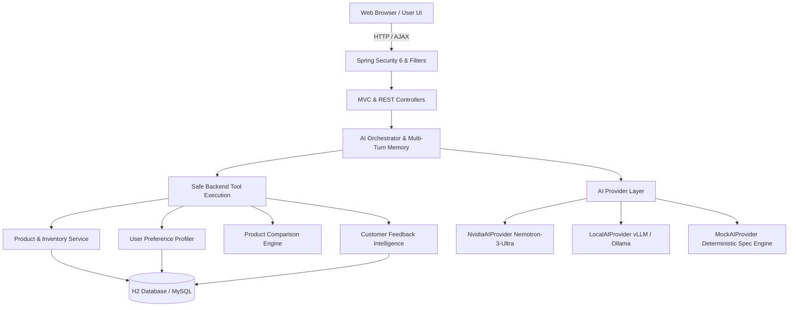

<div align="center">

# 🌌 OmniMart AI

### Autonomous AI-Powered E-Commerce Platform

[](https://openjdk.org/)
[](https://spring.io/projects/spring-boot)
[](https://build.nvidia.com/)
[](https://render.com/)
[](https://www.brevo.com/)
[](https://opensource.org/licenses/MIT)

**Architected by [Shubh Kumar](https://github.com/shubhyagami)**  
*© 2026 OmniMart AI Technologies Inc. All rights reserved.*

</div>

---

## 📑 Table of Contents
- [Overview](#overview)
- [Key Features](#key-features)
- [AI Architecture & Guardrails](#ai-architecture--guardrails)
- [Dynamic UI & Particle Engine](#dynamic-ui--particle-engine)
- [Network Geolocation & Mini-Map](#network-geolocation--mini-map)
- [Transactional Emails & OTP](#transactional-emails--otp)
- [AI Comparison Matrix](#ai-comparison-matrix)
- [Getting Started](#getting-started)
- [Deployment](#deployment)
- [Demo Accounts](#demo-accounts)
- [Environment Variables](#environment-variables)

---

## Overview

OmniMart AI is a next-generation e-commerce platform integrating an autonomous AI shopping assistant, hyper-personalized recommendations, and interactive UI elements. Built with Spring Boot 3 and a hybrid recommendation engine, it strictly enforces database-grounded AI responses to eliminate hallucinations.

## Key Features

1. **Procedural HTML5 Canvas Live Wallpaper**  
   Deep vector doodle engine rendering futuristic tech and e-commerce artifacts (smartphones, gaming rigs, delivery pods, AI neural nodes, microchips). Features a 3-layer parallax depth with physics-based proximity repulsion, glowing cursor auras, and dynamic constellation lines. Background doodles highlight in amber when products are suggested by the AI.

2. **Fluid Animated Shopping Cursor**  
   Glowing amber cursor with a fluid trailing ring and magnetic physics. Morphs into an animated bouncing shopping bag over actionable buttons and triggers a multicolored particle burst on clicks.

3. **Autonomous Agentic AI Shopping Assistant**  
   Powered by NVIDIA Nemotron-3-Ultra, the assistant queries real database inventory via structured safe tools (`toolRouter.searchProducts`). Ensures categorically accurate retrieval (e.g., *"gaming laptops"* return verified high-refresh GPU laptops). Supports context-aware multi-turn conversational memory.

4. **Multi-Factor Hybrid Recommendation Engine**  
   Weighted ranking algorithm calculating a score based on:
   $$\text{Score} = 0.35 \times \text{UserPreference} + 0.25 \times \text{BehavioralSim} + 0.20 \times \text{ContentRelevance} + 0.10 \times \text{Rating} + 0.10 \times \text{Popularity}$$
   Includes explainable *"Why this product?"* badges on every card.

5. **Customer Feedback Sentiment & Emotion Intelligence**  
   Deep sentiment extraction across customer reviews, classifying topics (*Battery, Display, Camera, Performance, Delivery*). Displays real-time Chart.js visual analytics in the Executive Admin Dashboard.

## AI Architecture & Guardrails



### Core AI Guardrails
- **Zero Hallucination Guarantee**: Product recommendations and spec comparisons pull candidate items strictly from JPA database queries.
- **No Raw SQL Execution**: Natural language queries are transformed into structured criteria without executing untrusted strings.
- **Sequential Multi-Key Fallback**: Automatic failover between NVIDIA API keys with instant fallback to the local deterministic engine on network timeouts.

## Dynamic UI & Particle Engine

| Component | Visual Feature | Implementation |
|---|---|---|
| **Cosmos Wallpaper** | Procedural 2D neon doodles, 3-layer parallax, glowing cursor aura | `live-wallpaper.js` & `live-wallpaper.css` |
| **Interactive Cursor** | Magnetic trailing ring, shopping bag morph, click particle burst | `cursor.js` & `main.css` |
| **Live Mini-Map** | Leaflet radar marker, dark tiles, pulse rings, IP scanner | `network-location.js` |
| **Comparison Matrix** | High-contrast glassmorphic table, WCAG 16.5:1 ratio, spec breakdown | `compare/compare.html` |
| **Glassmorphic Cards** | 16px backdrop-blur, gradient border glows, hover lift | Bootstrap 5.3 + Custom CSS Tokens |

## Network Geolocation & Mini-Map

- **Automatic Network Triangulation**: Determines City, State, Country, and Postal Code using public IP intelligence without requiring browser GPS permissions.
- **Navbar Delivery Pill**: Shows live destination (e.g., `Kolkata • 700009` or `Gurugram • 122001`).
- **Interactive Leaflet Mini-Map**: Centered on network coordinates with radar pulse animations and manual destination updates.

## Transactional Emails & OTP

- **API Integration**: Connects securely via `https://api.brevo.com/v3/smtp/email`.
- **Security Use-Cases**:
  - 6-digit OTP verification for new user registration.
  - 6-digit OTP verification for profile email changes.
  - Rich HTML order receipts with tracking links and itemized invoice details.
- **Email Compatibility**: Tested across Gmail, Apple Mail, and Outlook Dark Mode with inline table layouts.

## AI Comparison Matrix

- Multi-product comparator supporting up to 4 simultaneous items.
- Hardware matrix covering: **Processor, RAM, Storage, Display, Battery, Camera, OS, and Price**.
- Automated AI verdict banner highlighting:
  - 🏆 **Best Overall**: Highest composite hardware score.
  - 💡 **Best Value for Money**: Optimal feature-to-price ratio.
  - ⚡ **Best Performance**: Peak throughput and benchmark leader.

---

## Getting Started

### Prerequisites
- **Java 21** or later (`java -version`)
- **Maven 3.9+** (or use the included `mvnw` wrapper)
- **Docker** (optional, for containerized deployment)

### 1. Run Locally with Maven Wrapper
```bash
# Windows
.\mvnw.cmd spring-boot:run

# macOS / Linux
./mvnw spring-boot:run
```

Access the application at:
- **Storefront**: [http://localhost:8080](http://localhost:8080)
- **H2 DB Console**: [http://localhost:8080/h2-console](http://localhost:8080/h2-console)  
  *(JDBC URL: `jdbc:h2:mem:omnimartdb`, User: `sa`, Password: `""`)*

### 2. Build and Run with Docker
```bash
# Build multi-stage Docker image
docker build -t omnimart-ai:latest .

# Run container
docker run -p 8080:8080 -e AI_PROVIDER=nvidia omnimart-ai:latest
```

---

## Deployment

Deploy OmniMart AI to **Render** in under 3 minutes using Docker or Render Blueprints.

### Option 1: Render Blueprint (`render.yaml`) — Recommended
1. Fork or push this repository to GitHub.
2. Log in to the [Render Dashboard](https://dashboard.render.com/).
3. Click **New +** → **Blueprint**.
4. Select your repository. Render will automatically detect `render.yaml` and configure the web service.
5. Click **Apply**.

### Option 2: Deploy as a Docker Web Service
1. In Render Dashboard, click **New +** → **Web Service**.
2. Connect your GitHub repository.
3. Choose **Docker** as the runtime.
4. Set Environment Variables (see [Environment Variables](#environment-variables)).
5. Click **Create Web Service**.

> **Note**: The application is configured to automatically read Render's dynamic `$PORT` environment variable (`server.port: ${PORT:8080}`).

---

## Demo Accounts

Click **"🔑 Demo Account Credentials"** on the `/login` page to auto-fill credentials with 1 click:

| Role | Email | Password | Permissions |
|---|---|---|---|
| **Demo Customer** | `user@omnimart.com` | `password123` | Storefront, AI Assistant, Profile, Cart, Orders, Wishlist |
| **System Admin** | `admin@omnimart.com` | `admin123` | Executive Analytics Dashboard, Sentiment Charts, Admin AI Q&A |

---

## Environment Variables

| Variable | Default Value | Description |
|---|---|---|
| `PORT` | `8080` | Server HTTP port (auto-bound by Render) |
| `AI_PROVIDER` | `nvidia` | Active AI provider (`nvidia`, `local`, or `mock`) |
| `NVIDIA_API_KEYS` | *3-Key Fallback Pool* | Comma-separated NVIDIA API Keys |
| `NVIDIA_MODEL` | `nvidia/nemotron-3-ultra-550b-a55b` | Model identifier |
| `BREVO_API_KEY` | *Configured Key* | Brevo Transactional Email API Key |
| `BREVO_SENDER_EMAIL` | `support@omnimart-ai.com` | Verified sender address |
| `BREVO_SENDER_NAME` | `OmniMart AI` | Email sender name |

---

<div align="center">

**Designed & Crafted by [Shubh Kumar](https://github.com/shubhyagami)**  
*© 2026 OmniMart AI Technologies Inc. All rights reserved.*

</div>
